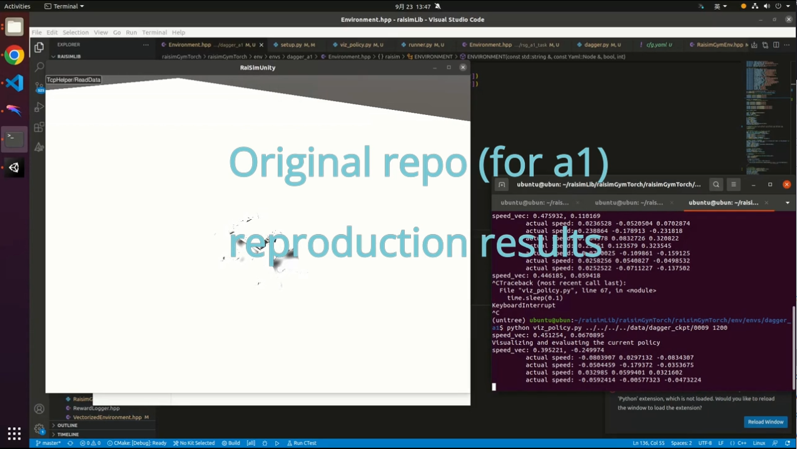
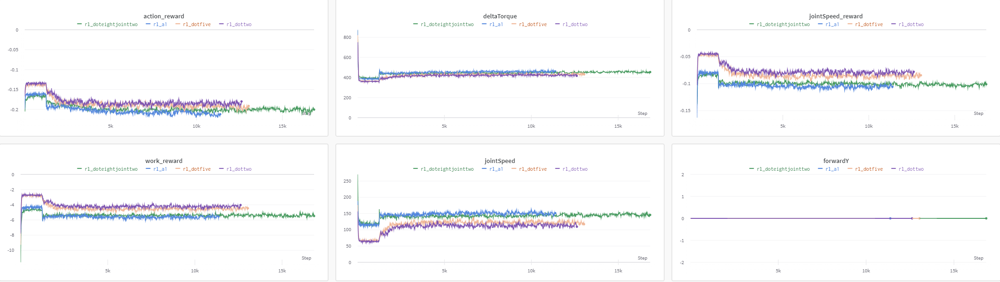
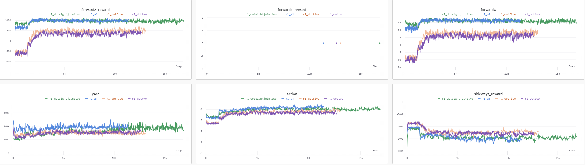

#  RL_LOCOMOTION For Go1-NX

This repo builds on the code from [rl_locomotion](https://github.com/antonilo/rl_locomotion)

## Usage
Completely follow the steps of the original warehouse for installation and use
```
Depending on each individual's environment, 
there may be some minor issues when configuring the environment,
but you can solve your problems through Google
```

## Change
### First
Reset rewards to correct unstable standing issues. see video:
[](https://youtu.be/oe6PWElBSbU?si=NY79DmdgkKsuuxPC)

### second
Crop the [Go1 description](https://github.com/boyuandeng/go1_description) file provided by Unitree to adapt to the old version of raisim

### Third
Updated `jt_mean_pos` in [this file](https://github.com/boyuandeng/rl_locomotion_go1/blob/main/raisimGymTorch/env/envs/rsg_a1_task/Environment.hpp) and [this](https://github.com/boyuandeng/rl_locomotion_go1/blob/main/raisimGymTorch/env/envs/dagger_a1/Environment.hpp)

## Results
I conducted experimental comparisons, including modifying different hyperparameters and adjusting rewards.


The `blue curve` represents the results of training the initial code under a1, 
while the other curves represent the results of training under go1. 
The `purple` and `yellow` curves represent the training results when the `RL_coeff` parameters are `0.2` and `0.5`, respectively, 
with a greater error compared to the original curve. 
The `green curve` is the result of setting the RL parameter to 0.8 and modifying the reward. 
It can be seen that only the green curve is closest to the original training result






